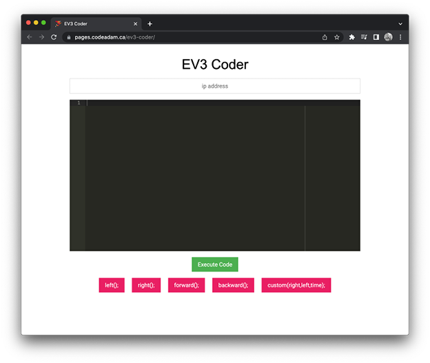

# LEGO® Mindstorms® EV3 Coder Tool

An online tool to add basic commands to an EV3 robot. Device must be on the same wifi network as the EV3 robots.

> The coder tool is avaiulable to view at:  
> [https://pages.codeadam.ca/ev3-coder/](https://pages.codeadam.ca/ev3-coder/)

---

## Repo Resources

- [LEGO EV3](https://www.lego.com/en-ca/product/lego-mindstorms-ev3-31313)

